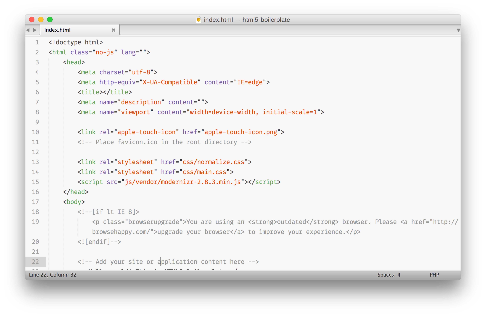
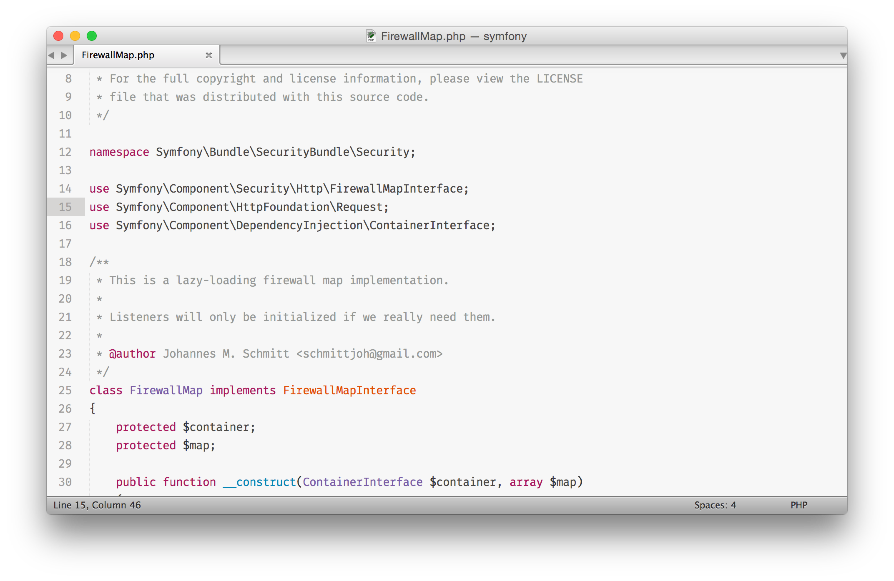
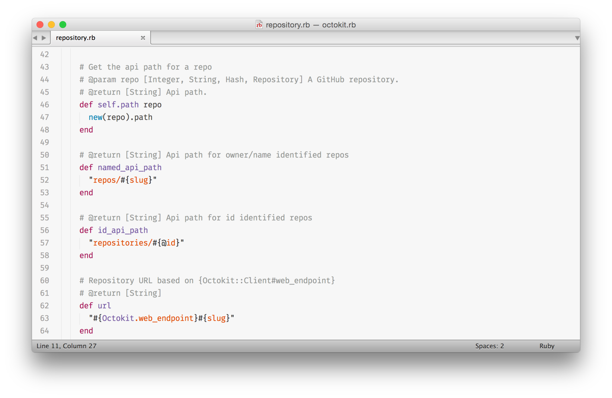

# GitHub's late 2014 syntax

Ports also available for your favourite editor

- **Atom**: [jacobbednarz/atom-github-2014-syntax](https://github.com/jacobbednarz/atom-github-2014-syntax)

### Previews

*HTML*

*PHP*

*Ruby*

### Issues

Found something that doesn't quite match up? Please
[create an issue](https://github.com/jacobbednarz/github-syntax-2014/issues).
Bonus points if you provide a patch for your issue! :gift: :tada:

### License

Licensed under the MIT license. Enjoy.
